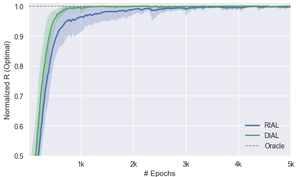

# Learning to Communicate with Deep Multi-Agent Reinforcement Learning

This is a PyTorch implementation of the [original Lua code release](https://github.com/iassael/learning-to-communicate). 

## Overview
This codebase implements two approaches to learning discrete communication protocols for playing collaborative games: Reinforced Inter-Agent Learning (RIAL), in which agents learn a factorized deep Q-learning policy across game actions and messages, and Differentiable Inter-Agent Learning (DIAL), in which the message vectors are directly learned by backpropagating errors through a noisy communication channel during training, and discretized to binary vectors during test time. While RIAL and DIAL share the same individual network architecture, one would expect learning to be more efficient under DIAL, which directly backpropagates downstream errors during training, a fact that is verified in comparing the performance of the two approaches.

## Execution
```
$ virtualenv .venv
$ source .venv/bin/activate
$ pip install -r requirements.txt
$ python main.py -c config/switch_3_dial.json
```
## Results for switch game


This chart was generated by plotting an exponentially-weighted average across 20 trials for each curve.

## More info
More generally, `main.py` takes multiple arguments:

| Arg | Short | Description | Required? |
| ------ | ------ | ------- | ------- | 
| --config_path | -c | path to JSON configuration file | ✅ |
| --results_path | -r | path to directory in which to save results per trial (as csv) | - |
| --ntrials | -n | number of trials to run | - |
| --start_index | -s | start-index used as suffix in result filenames | - |
| --verbose | -v | prints results per training epoch to stdout if set | - |  

##### Configuration
JSON configuration files passed to `main.py` should consist of the following key-value pairs:

| Key | Description | Type |
| ------ | ------ | ------- |
| game | name of the game, e.g. "switch" | string |
| game_nagents | number of agents | int |
| game_action_space | number of valid game actions | int |
| game_comm_limited | true if only some agents can communicate at each step | bool |
| game_comm_bits | number of bits per message | int |
| game_comm_sigma | standard deviation of Gaussian noise applied by DRU | float |
| game_comm_hard | true if use hard discretization, soft approximation otherwise | bool |
| nsteps | maximum number of game steps | int |
| gamma | reward discount factor for Q-learning | float |
| model_dial | true if agents should use DIAL | bool |
| model_comm_narrow | true if DRU should use sigmoid for regularization, softmax otherwise | bool |
| model_target | true if learning should use a target Q-network | bool |
| model_bn | true if learning should use batch normalization | bool |
| model_know_share | true if agents should share parameters | bool |
| model_action_aware | true if each agent should know their last action | bool |
| model_rnn_size | dimension of rnn hidden state | int |
| bs | batch size of episodes, run in parallel per epoch | int |
| learningrate | learning rate for optimizer (RMSProp) | float |
| momentum | momentum for optimizer (RMSProp) | float |
| eps | exploration rate for epsilon-greedy exploration | float |
| nepisodes | number of epochs, each consisting of <bs> parallel episodes | int |
| step_test | perform a test episode every this many steps | int |
| step_target | update target network every this many steps | int |

##### Visualizing results
You can use `analyze_results.py` to graph results output by `main.py`. This script will plot the average results across all csv files per path specified after `-r`. Further, `-a` can take an alpha value to plot results as exponentially-weighted moving averages, and `-l` takes an optional list of labels corresponding to the paths.
```
$ python util/analyze_results -r <paths to results> -a <weight for EWMA>
```

## Bibtex
    @inproceedings{foerster2016learning,
        title={Learning to communicate with deep multi-agent reinforcement learning},
        author={Foerster, Jakob and Assael, Yannis M and de Freitas, Nando and Whiteson, Shimon},
        booktitle={Advances in Neural Information Processing Systems},
        pages={2137--2145},
        year={2016} 
    }
    
## License
Code licensed under the Apache License v2.0